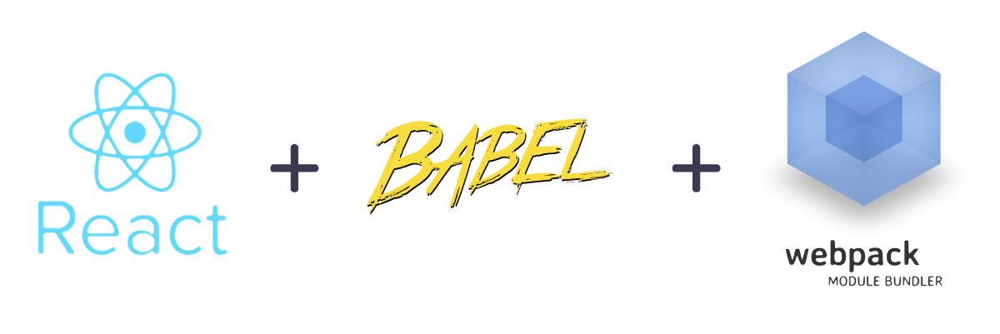

# Configurar react desde cero con WebPack y Babel

Actualmente existen infinidad de proyectos que ofrecen un punto de partida para la configuración de una aplicación react. Realizar esta configuración desde cero es una tarea que puede llegar a ser complicada si no tiene los pasos claros. Por esta razón muchos desarrolladores utilizan generadores de aplicaciones para realizar esta tarea.



no de los generadores más utilizados es [Create react app](https://github.com/facebook/create-react-app) creado y mantenido por los desarrolladores de facebook.

Antes de iniciar con el tutorial, asegurate de tener instalado la última versión de [NPM](https://www.npmjs.com/) y [NODEJS](https://nodejs.org/es/) si no la tienes, instala nodejs que ya trae integrado npm. Actualmente tengo instalado `node 10.1.0` y `npm 6.4.1`

### 1 - Configuración inicial

Crear directorio del proyecto y acceder

```bash
mkdir react-desde-cero && cd $_
```

Iniciamos un proyecto de npm

```bash
npm init
```

Para evitar las preguntas del generador de npm, utiliza:

```bash
npm init -y
```

```javascript
{
  "name": "react-webpack-babel",
  "version": "1.0.0",
  "description": "",
  "main": "index.js",
  "scripts": {
    "test": "echo \"Error: no test specified\" && exit 1"
  },
  "keywords": [],
  "author": "Geordano Polanco (gpolanco.com)",
  "license": "MIT"
}
```

Utilizaremos la configuración de directorios típica de una aplicación react.

```bash
react-webpack-babel
├── package.json
└── src
   ├── index.html
   └── index.js
```

Creamos el directorio `src` además y los archivos`index.html` e `insdex.js`

En el archivo `index.html` utilizaremos un template básico para vincular el archivo `index.js.` Agregar la etiqueta `<div id="root"></div>` que utilizaremos más adelante en nuestra aplicación react.

Pega el siguiente código en el archivo `index.html`

```markup
<!DOCTYPE html>
<html lang="en">
<head>
  <meta charset="UTF-8">
  <meta name="viewport" content="width=device-width, initial-scale=1.0">
  <meta http-equiv="X-UA-Compatible" content="ie=edge">
  <title>Config react app</title>
</head>
<body>
  <div id="root"></div>
</body>
</html>
```

Ya tenemos los archivos mínimos para iniciar la **configuración de una** _**aplicación react**_, ahora empezamos a agregar las dependencias necesarias

### 2 - Configurar webpack

**Instalación de dependencias**

```bash
npm install --save-dev webpack webpack-cli webpack-dev-server

# O lo mismo abreviado

npm i -D webpack webpack-cli webpack-dev-server
```

* [**webpack**](https://webpack.js.org/) El paquete principal de webpack que utilizaremos más adelante para el transpilado del código scss, jsx de la aplicación, actualmente el su versión `4.20.2`
* [**Webpack-dev-server - npm**](https://www.npmjs.com/package/webpack-dev-server) Este nos da la opción de ejecutar un servidor local en nuestro directorio. Además nos da la ventaja de ver los cambios realizados en tiempo real en el navegador. Actualmente en la versión `3.1.9`
* [W**ebpack-cli - npm**](https://www.npmjs.com/package/webpack-cli) Esta herramienta nos permite utilizar `webpack` en la línea de comando

Si comprobamos nuestro archivo `package.json`podemos notar que tenemos una nueva sección **devDependencies** donde tenemos los paquetes instalados anteriormente.

```javascript
"devDependencies": {
    "webpack": "^4.21.0",
    "webpack-cli": "^3.1.2",
    "webpack-dev-server": "^3.1.9"
}
```

Como puedes notar las dependencias instaladas están en su última versión, en la configuración de webpack **es importante la compatibilidad entre versiones**, con lo cual voy a fijar las versiones a las últimas actuales quitando este símbolo `^` de esta forma las dependencias estarán en la versión indicada.

Esto lo hago por si alguien se descarga el código pasado unos meses, siga funcionando aunque estén disponibles nuevas versiones. Recomiendo siempre utilizar las últimas versión estable a la hora de configurar un proyecto inicial.

```javascript
"devDependencies": {
    "webpack": "^4.21.0",
    "webpack-cli": "^3.1.2",
    "webpack-dev-server": "^3.1.9"
}
```

Con las instalaciones anteriores, tenemos el directorio **node\_modules** donde se guardan todas las dependencias del proyecto y el archivo [**package-lock.json**](https://docs.npmjs.com/files/package-lock.json) utilizado por npm.

Actualmente esta es la estructura de directorios de la aplicación, después de instalar las dependencias de **webpack 4**

```bash
react-webpack-babel
├── node_modules
├── package-lock.json
├── package.json
└── src
   ├── index.html
   └── index.js
```

#### Configuración de webpack <a id="Configuraci%C3%B3n-de-webpack"></a>

Desde `webpack v4`no es necesario crear un archivo de configuración para su funcionamiento, pero, si quieres crear una configuración personalizada solo de lo que necesitas, entonces, si es necesario.

Actualmente tenemos instalado webpack y quiero ejecutar tanto **webpack** como **webpack-dev-server** para que notes su funcionamiento sin un archivo de configuración personalizado.

Para hacer esta prueba agregamos los siguientes comando en la sección `scripts` de nuestro archivo `package.json`

```javascript
"scripts": {
 "start": "webpack-dev-server --mode development --open",
 "build": "webpack --mode production"
},
```

**`npm run build`:** Al ejecutar este comando webpack utiliza su configuración predeterminada, compilará el archivo `src/index.js`, comprimiéndolo en la carpeta `dist/main.js`.

**`npm start`:** Al ejecutar `npm start`, queremos que se visualice el archivo `index.html` localizado en la carpeta `src/index.html`pero puedes notar que nos muestra un listado de los archivos que existen en la carpeta principal del proyecto. Esto es debido a que webpack necesita un plugin adicional \([HTML Webpack Plugin](https://github.com/jantimon/html-webpack-plugin) \) para procesar el HTML.

#### Configurando HTML Webpack plugin

```bash
npm i --save-dev html-webpack-plugin
```

Creamos el archivo `webpack.config.js` 

> Webpack 4 establece por defecto la propiedad `entry: 'src/index.js'`  y `output: 'dist/main.js'` si tu estructura es diferente, puede modificar este funcionamiento desde el archivo de configuración.

Por ahora solo agregamos la configuración para HTML webpack plugin.

```javascript
const path = require('path');
const HtmlWebPackPlugin = require("html-webpack-plugin");


// Webpack configuration
module.exports = {
  plugins: [
    new HtmlWebpackPlugin({
      template: path.join(__dirname, 'src', 'index.html'),
      filename: 'index.html'
    })
  ]
};
```

Añade algún contenido en tu archivo index.html y ejecuta el comando npm start, podrás notar que webpack ya reconoce el HTML.

Por otro lado, si ejecutas el comando npm run build, webpack genera el directorio dist con el archivo `index.html` y la vinculación del archivo `index.js`

#### Configuración personalizada de webpack

Esta muy bien la configuración predeterminada, pero yo quiero modificar los siguientes puntos.

1. El archivo `index.html` quiero que este en `public/index.html` y no en `src`, ya que, este directorio sólo deben estar alojados los archivos .jsx de nuestra aplicación. 
2. Renombrar el archivo de salida a `main.bundle-[hash].js` más un hash auto generado, en vez de `index.js`. Esto lo hacemos sobre escribiendo la configuración output de webpack. 
3. Establecer el modo a development basado en la variable de entorno `process.env.NODE_ENV` de nodejs, de esta forma no tengo que agregarlo en el `package.json`

Este será el resultado las modificaciones anteriores.

```javascript
const HtmlWebPackPlugin = require("html-webpack-plugin");
const path = require('path');

module.exports = {
  output: {
    path: path.join(__dirname,'dist'),
    filename: 'main.bundle-[hash].js'
  },
  
 mode: process.env.NODE_ENV || 'development',
  
  plugins: [
    new HtmlWebPackPlugin({
      template: path.join(__dirname,'public','index.html'),
      filename: 'index.html'
    })
  ]
};
```

Puntos importantes del archivo `webpack.config.js`

1. **Entry**: Entrada de referencia para webpack, **por defecto en webpack 4** `src/index.js`
2. **Output**: Punto de salida **por defecto en webpack 4** `dist/index.js` , en nuestro caso `dist/main.bundle-[hash].js`
3. **mode**: Indica el modo en que se está ejecutando nuestra aplicación, con esto webpack sabe como compilar nuestro archivos basándose en en el modo `development` o `production` esto se puede configurar utilizando las variables de entorno de nodejs, en nuestro caso lo dejamos en modo `developer` si no existe una variable de entorno.
4. **resolve** Esto nos da la facilidad de poder utilizar importaciones con rutas relativas en ves de rutas absolutas, indicando los directorios donde buscar dichas importaciones a webpack, por ahora no lo voy a utilizar.
5. **devServer** configuración del servidor de desarrollo, puedes ver todas las opciones disponibles en la [documentacion de webpack dev server](https://webpack.js.org/configuration/dev-server/#devserver)


Ya tenemos webpack y webpack de server configurado, ahora necesitamos configurar todo lo necesario para empezar a utilizar reatjs.


### 3 - Configurar babel

En react trabajaremos utilizando la sintaxis de [ECMAScript® 2016](https://www.ecma-international.org/ecma-262/7.0/) además de jsx, pero no todos los navegadores soportan esta versión de javascript, para esto utilizaremos [babeljs](https://babeljs.io/), para transpilar el código de react a ES5 soportado por todos los navegadores.

Instalemos las dependencias de babel. Actualmente instalamos **babel 7** el cual a cambiado su nomenclatura de nombre.

Para empezar a utilizar babel-loader instalaremos las siguientes dependencias.

```bash
npm i -D babel-loader @babel/core @babel/preset-env @babel/preset-react
```

* **babel-loader:**  Es el cargador de paquetes, para transpilar ES6 y superior, hasta ES5.
* \*\*\*\*[**@babel-core**](https://babeljs.io/docs/en/babel-core#docsNav)
* \*\*\*\*[**@babel-preset-env**](https://babeljs.io/docs/en/babel-preset-env)

Modificamos el archivo `webpack.config.js` añadimos babel-loader

```javascript
const HtmlWebPackPlugin = require("html-webpack-plugin");
const path = require('path');

module.exports = {
  // ...
  
  // LOADERS
   module: {
    rules: [
      {
        test: /\.js$/,
        exclude: /node_modules/,
        use: {
          loader: "babel-loader"
        }
      }
    ],
  },

  // ...
};
```

Ahora necesitamos agregar algunas opciones a **babel-loader**, esto se puede hacer en el `webpack.config.js`, pero es recomendable hacerlo en el archivo `.babelrc` para tener esta configuración separada y una mejor legibilidad. Creamos el archivo .babelrc y agregamos el siguiente código.

```javascript
{
    "presets": [
        "@babel/preset-env"
    ]
}
```

Ahora ya tenemos nuestro proyecto preparado para trabajar con **ES6**, puedes agregar algún código de ES6 en el archivo `src/index.js` y ejecutar `npm run build`, si revisas el archivo generado en dist al final podrás notal como babel ha transpilado el código de ES6 a su equivalente en **ES5**.


Ahora nuestro proyecto está preparado para utilizar las nuevas funcionalidades de ES6.


### 4 - Configurar Reactjs

Teniendo configurado webpack y babel ahora es sencillo configurar react.

Instalar dependencias para reactjs. 

```bash
npm install --save react react-dom

// o bien

npm i -S react react-dom
```

También necesitamos instalar el preset `@babel/preset-react`

```bash
npm install --save-dev @babel/preset-react
```

* \*\*\*\*[**@babel/preset-react**](https://babeljs.io/docs/en/next/babel-preset-react.html)**:** Realiza varias funciones, ya que tiene integrado otros plugin de babel. Se encarga de entender el código JSX y transformarlo en código con la sintaxis de react, entre otras cosas. Incluye los siguientes babel plugins.
  * [@babel/plugin-syntax-jsx](https://babeljs.io/docs/en/next/babel-plugin-syntax-jsx)
  * [@babel/plugin-transform-react-jsx](https://babeljs.io/docs/en/next/babel-plugin-transform-react-jsx)
  * [@babel/plugin-transform-react-display-name](https://babeljs.io/docs/en/next/babel-plugin-transform-react-display-name)

Configurar `@babel/preset-react` en el archivo .babelrc 

```javascript
{
  "presets": [
    "@babel/preset-env",
    "@babel/preset-react"
  ]
}
```

Modificamos el archivo `webpack.config.js` para agregar la extensión jsx en el babel loader. de esta forma podemos usar `.js` o `.jsx` en nuestro archivos.

```javascript
// ...
module.exports = {
  // ...
  module: {
    rules: [
      {
        test: /\.(js|jsx)$/,
        exclude: /node_modules/,
        use: {
          loader: "babel-loader"
        }
      }
    ],
  },
  // ...
};
```


React configurado!!! Ya tenemos tod listo para empezar a escribir los componentes de nuestra aplicación.


Para hacer la prueba de renderizado de un componente en un archivos jsx.

* Crea el archivo `App.jsx` y pega este código

```javascript
// App.jsx
import React from "react";

const App = () => {
  return (
    <div>
      <h2>App component!</h2>
    </div>
  );
};

export default App;
```

* Renombramos el archivo `index.js` a `index.jsx`
* Webpack por defecto no reconoce la extensión `.jsx`, debemos decirle desde su archivo de configuración, que extesiones puede resolver. Por defecto resuelve .js

```javascript
resolve: {
    extensions: ['.js', '.json', '.jsx'],
}
```

Este es el aspecto de nuestro archivo `webpack.config.js`

```javascript
const HtmlWebPackPlugin = require("html-webpack-plugin");
const path = require('path');

module.exports = {
  output: {
    path: path.join(__dirname,'dist'),
    filename: 'main.bundle-[hash].js'
  },

  module: {
    rules: [
      {
        test: /\.(js|jsx)$/,
        exclude: /node_modules/,
        use: {
          loader: "babel-loader"
        }
      }
    ],
  },

  resolve: {
    extensions: ['.js', '.json', '.jsx'],
  },

  // EVIROMENT MODE
  mode: process.env.NODE_ENV || 'development',
  
  plugins: [
    new HtmlWebPackPlugin({
      template: path.join(__dirname,'public','index.html'),
      filename: 'index.html'
    })
  ]
};
```

Si lanzamos la aplicación `npm start` debería de renderizar 

**App component!**

Ya tenemos la aplicación completamente configurada, ahora podemos empezar a desarrollar!!!

### 5 - Configurar scss

Ahora configuraremos webpack para poder importar archivos `.css` y `.scss` desde los componentes de react

Instalamos `node-sass`, `sass-loader` ,  `css-loader` y `style-loader`

```bash
npm install --save-dev css-loader node-sass sass-loader style-loader
```

Modificamos el archivo `webpack.config.js` agregando los siguientes loaders.

```javascript
{
  test: /\.s?css$/, // archivos .css o .scss
  use: [
    { loader: 'style-loader' },
    { loader: 'css-loader' },
    { loader: 'sass-loader'},
  ]
}
```

Para probar el funcionamiento, agregamos un nuevo archiv index.scss y lo importamos en nuestro archivo index.jsx

```javascript
import './index.scss'
```

Agrega alguna regla css para modificar el body de la aplicación y ejecuta `npm start` para visualizar los cambios.


Con esto ya tenemos nuestro proyecto preparado para utilizar estilos tanto con scss como con css normal. 


### 6 - Importación de imagenes en webpack 4

Con Webpack, el uso de activos estáticos como imágenes y fuentes funciona de manera similar a CSS.

> Puede **`import`un archivo directamente en un módulo de JavaScript** . Esto le dice a Webpack que incluya ese archivo en el paquete. A diferencia de las importaciones de CSS, la importación de un archivo le da un valor de cadena. Este valor es la ruta final a la que puede hacer referencia en su código, por ejemplo, como el `src`atributo de una imagen o el `href`enlace de un PDF.
>
> Para reducir la cantidad de solicitudes al servidor, la importación de imágenes que tienen menos de 10,000 bytes devuelve un [URI de datos en](https://developer.mozilla.org/en-US/docs/Web/HTTP/Basics_of_HTTP/Data_URIs) lugar de una ruta. Esto se aplica a las siguientes extensiones de archivo: bmp, gif, jpg, jpeg y png. 
>
> [react app description](https://facebook.github.io/create-react-app/docs/adding-images-fonts-and-files)

Para la importación de archivos utilizaremos [file-loader](https://github.com/webpack-contrib/file-loader) 

```text
npm install file-loader --save-dev
```

Agregamos el loader a nuestro archivo `webpack.config.js`

```javascript
{
  test: /\.(png|jpg|gif)$/,
  loader: 'file-loader',
  options: {
    name: 'static/media/[name].[hash:8].[ext]',
  },
}
```

Ahora si importamos uno de estos tipos de imágenes en un componente, podemos utilizar la variable de importación y renderizar la imagen. Si te fijas en el `src` de la etiqueta `img`, la ruta del archivo será algo como esto.

```markup

```


Esta es la base para cualquier proyecto en reactjs, ahora solo debemos agregar cualquier otra configuración que necesitemos durante el proceso de desarrollo.

Puede [descargar este repositorio desde mi cuenta de github](https://github.com/gpolanco/react-desde-cero), para que te sirva de inicio rápido.



